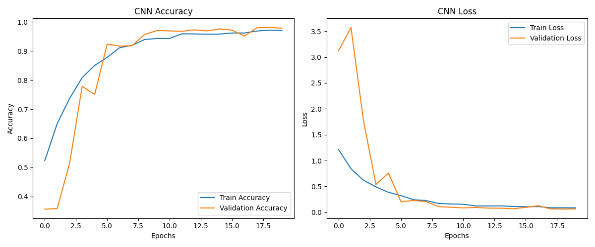
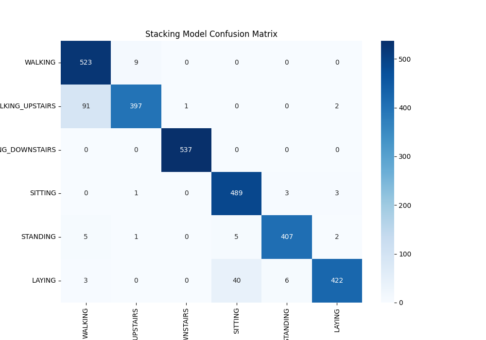
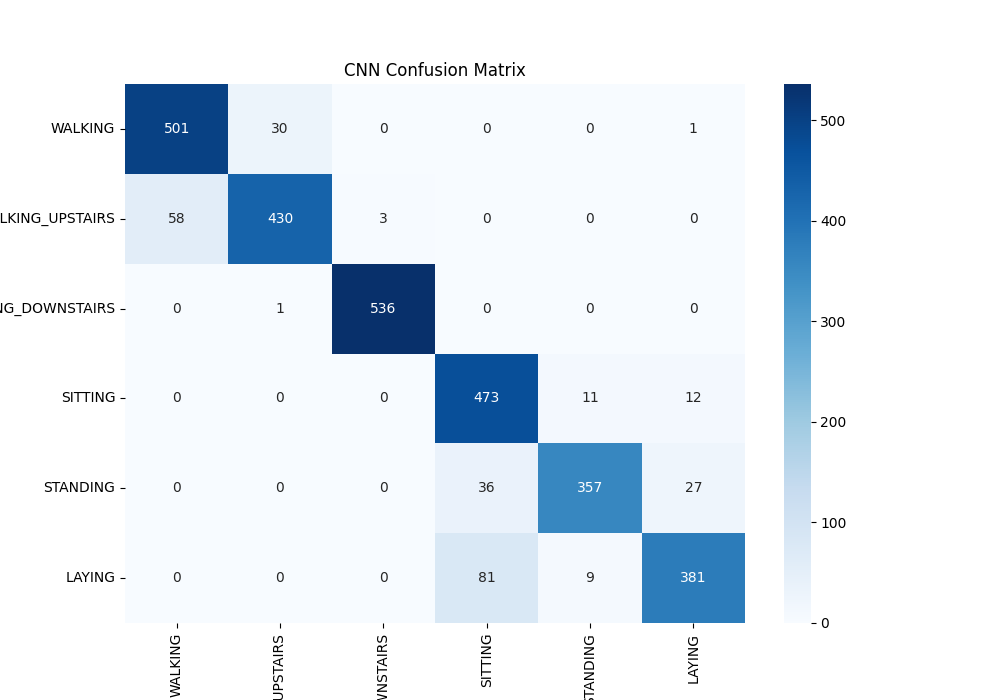
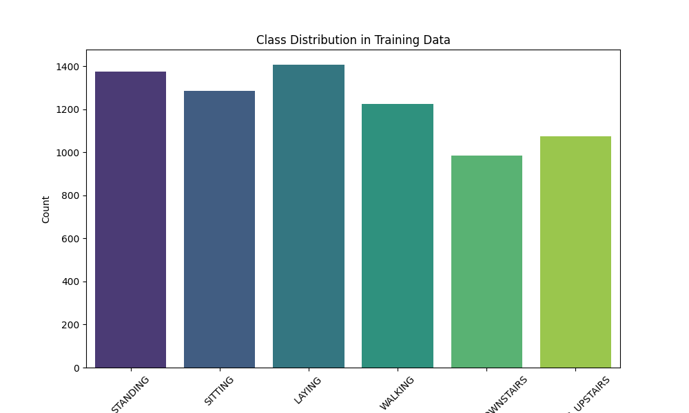

# Human Activity Recognition with Advanced Machine Learning Models

This project focuses on Human Activity Recognition (HAR) using advanced machine learning techniques, including Stacking Classifier and Convolutional Neural Networks (CNN). The goal is to accurately classify human activities based on sensor data using multiple models, evaluate their performance, and provide insights into model accuracy.

This research has been published on the [CATA 2025 website](https://www.nwmissouri.edu/csis/CATA2025/index.htm).

## Libraries Used

The following libraries are used in the project:
- `pandas`: Data manipulation and analysis
- `numpy`: Numerical operations
- `seaborn`: Data visualization
- `matplotlib`: Plotting graphs
- `sklearn`: Machine learning algorithms and utilities
- `xgboost`: Gradient boosting classifier
- `tensorflow.keras`: Deep learning model building and training

## Dataset

The dataset consists of sensor data used for training and testing a variety of models for Human Activity Recognition. The dataset contains the following files:
- `X_train.txt`, `y_train.txt`: Training data and corresponding activity labels
- `X_test.txt`, `y_test.txt`: Test data and corresponding activity labels
- `activity_labels.txt`: Mapping of activity labels to human-readable activity names

## Project Workflow

### 1. Data Preprocessing
- The dataset is loaded from specified file paths using `pandas`.
- Activity labels are mapped to corresponding activity names.
- The categorical labels are converted to integer indices for model compatibility.
- Preprocessing pipelines are applied to scale numerical features and one-hot encode categorical features.

### 2. Model Building
#### Stacking Classifier
A **stacking model** is built using multiple base classifiers and a logistic regression meta-learner:
- Base classifiers: Perceptron, RandomForest, SVC, XGBoost, GradientBoosting
- Meta-learner: Logistic Regression
- Cross-validation with 3 folds is used to train the stacking model.

#### Convolutional Neural Network (CNN)
A **CNN model** is built with the following architecture:
- Multiple `Conv1D` layers with `MaxPooling1D` and `BatchNormalization` for feature extraction.
- Dropout layers to prevent overfitting.
- `GlobalAveragePooling1D` followed by dense layers for classification.

### 3. Model Training
- The stacking model and CNN are trained using `train_test_split` for validation and evaluation.
- Class weights are computed to handle class imbalance during model training.
- `EarlyStopping` and `ReduceLROnPlateau` callbacks are used to optimize training.

### 4. Model Evaluation
- Both models are evaluated on a separate test set using accuracy as the primary metric.
- Confusion matrices are plotted for both models to visualize classification performance.
- The class distribution in the training data is visualized to understand label imbalances.

### 5. Results and Visualization
- Training and validation accuracy/loss curves are plotted for the CNN model.
- Confusion matrices for both the stacking model and CNN are displayed.
- The class distribution of the training dataset is visualized to check for class imbalances.

## Key Achievements
- **Stacking Model**: Achieved high accuracy by combining various classifiers.
- **CNN Model**: Enhanced model architecture with multiple convolutional layers and regularization to prevent overfitting.
- **Data Visualization**: Effective use of confusion matrices and class distribution plots for model evaluation.

## Future Work
- **Improving Performance**: Further tuning hyperparameters, adding more layers to the CNN, and exploring other models for the stacking classifier.
- **Real-Time Prediction**: Applying the model to real-time sensor data for live human activity recognition.

## Visualization Examples

1. **CNN Training Accuracy and Loss**:
   

2. **Confusion Matrix for Stacking Model**:
   

3. **Confusion Matrix for CNN**:
   

4. **Class Distribution in Training Data**:
   

## Conclusion
This research demonstrates the successful implementation of machine learning models to recognize human activities using sensor data. The results highlight the effectiveness of advanced models like stacking classifiers and CNNs in handling the complexity of HAR tasks.

For more details, please visit the published research on [CATA 2025](https://www.nwmissouri.edu/csis/CATA2025/index.htm).
